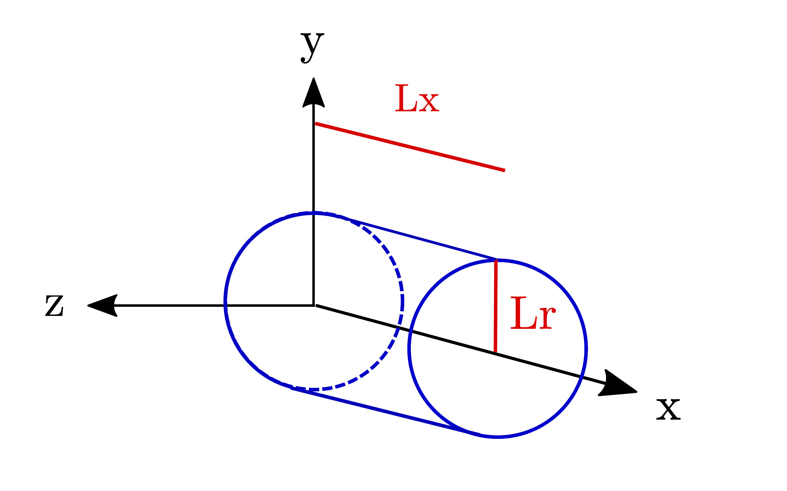

Exercises
^^^^^^^^^^^^^^^^^^^^^^^^^^^^^^^^^^^^^^^^^^^^^^^^^^^^^^^^^^^^^^^^^^^^

.. _warningExercises:
Tips for the exercises
------------------------------------------

- **Organization**: you will soon arrive to exercises that ask to run one or more simulations.
  To avoid overwriting previous simulation data, and to avoid forgetting where previous simulations were run 
  (especially if you want to recheck your answers), create a new folder for each simulation, 
  giving it a meaningful name, and keeping your data space organized. 
  If it helps, you may also take notes on the path of the folders to remember where each simulation was run.
- **Read the namelist**: the comments in the namelist and the defined variables contain also useful information for exercises.
- **Read again the practical presentation**: some of the explained concepts may help you during the exercises.
- **Parallelizing the simulations**: While working on a supercomputer, normally to launch a new simulation you don't have to wait for the last one you have launched to be complete.
  If no computing resources are available yet, the newly launched simulations will wait in the queue.
- **Questions? Doubts?** Ask the instructor!

.. _exploringthenamelist:
Exploring the input namelist
------------------------------------------

To run a simulation, you need to specify the phenomena it will describe and 
the numerical parameters to study your case, e.g. the resolution, the integration timestep, the grid size,
in an input file, in this case called ``InputNamelist.py``.

In the next few exercises we will understand the basic set-up of a simulation described this file.

One of the first variables we define in this simulation is the ``lambda0``, i.e. the laser carrier frequency 
:math:`\lambda_0`.

.. _exercise1:
.. admonition:: Exercise 1

   Assuming :math:`\lambda_0=0.8 \mu m` (a Ti:Sa laser system), what is the value of the critical density :math:`n_c`?
   
   What is the value of the reference electric field :math:`E_0=(2\pi m_e c^2)/(e\lambda_0)`? 
   
   This choice of :math:`\lambda_0` will be used throughout all subsequent exercises. 
   
   **Hint**: Some lines at the start of the ``InputNamelist.py`` file can help you in the calculations.

The ``InputNamelist.py`` file starts with the definition of physical constants and units,
mesh points, integration timestep, etc. 
Some of these parameters are inserted in the first block of the simulation, called ``Main`` block. 
Others may be useful for conversions between units or to define other variables in the file.

In the ``Main`` block, you will also find the geometry of the simulation, which is ``AMcylindrical``.
The grid where Maxwell's equations are solved is defined on a cylindrical space and with cylindrical coordinates `x`, `r`, but the particles move in the 3D space 
`x`, `y`, `z` (See :ref:`Fig. 1 <Mesh_and_Reference>`). 
The use of cylindrical coordinates with cylindrical symmetry enables quick 
simulations with accuracy comparable to 3D simulations.

Note a block called ``MovingWindow`` in the `InputNamelist.py <https://github.com/SmileiPIC/TP-M2-GI/blob/main/InputNamelist.py>`_. 
In the physical case being considered, a laser pulse with duration of tens 
of femtoseconds propagating along the positive `x` direction is simulated.  
We are only interested in phenomena near the laser pulse 
(within tens of microns), like plasma wave excitation, so a ``Moving Window`` is defined, 
which emulates a camera moving at the speed 
we want, along the positive `x` direction. 
In this physical case, the moving window speed is set to `c` to follow the laser. As a result, 
the laser pulse is almost immobile in the simulation window.

.. _Mesh_and_Reference:

  Reference axes of the simulation. The simulation window corresponds to the cylinder with radius ``Lr`` and length ``Lx``.

.. _Schema_Simulation_0:
.. figure:: _static/Schema_Simulation_0.png
  :width: 15cm

  Simulation set-up at the start of the simulation in this Section (not to scale)

.. _exercise2:    
.. admonition:: Exercise 2

   What are the longitudinal size ``Lx`` and radial size ``Lr`` of the simulation window?
   
   How many mesh points ``nx`` and ``nr`` are used in the longitudinal and radial directions? 
   
   What is the resolution ``dx`` and ``dr`` in the longitudinal and radial directions? 
   
   See Figures :ref:`1 <Mesh_and_Reference>` and, :ref:`2 <Schema_Simulation_0>` for reference, and find these lengths in the `InputNamelist.py <https://github.com/SmileiPIC/TP-M2-GI/blob/main/InputNamelist.py>`_.
   
   **Note**: executing the namelist lines defining the variables ``Lx`` and ``Lr`` will give their values in normalized units, not in physical units.

At the end of the `InputNamelist.py <https://github.com/SmileiPIC/TP-M2-GI/blob/main/InputNamelist.py>`_ file,
there are blocks starting with the word ``Diag``. 
These blocks are for the diagnostics/outputs of the code. 
The first Diag is a ``DiagProbe`` defined on a line 
(so a 1D diagnostic), on the propagation axis of the laser (the `x` axis). 
This diagnostic returns the value of some physical fields 
along that axis. We call this probe ``Probe0`` (the ``0`` because 
it is the first ``Probe`` in the namelist). The second diagnostic block is 
a ``DiagProbe`` defined on the plane `xy` (so a 2D diagnostic). 
This is the second probe of the namelist, so it is called ``Probe1``.

|
|

.. _laserpulseinvacuum:
Laser pulse in vacuum
--------------------------------------------------------

Everything is ready to run your first simulation. 
We will start adding a laser pulse propagating in vacuum, along the positive ``x`` direction.

**Action**: in the ``InputNamelist.py`` file, uncomment the lines 
with the laser pulse parameters and the ``LaserEnvelopeGaussian`` block. 
Afterwards, launch the simulation.

This block defines a laser pulse in the simulation with a transverse field based on the definition of a Gaussian Beam [Siegman]_, 
with a carrier wavelength :math:`\lambda_0 = 0.8 \mu m`. 
The considered pulse also has Gaussian temporal profile, whose FWHM length is much larger 
than the laser carrier wavelength :math:`\lambda_0`, defined in the variable ``lambda0`` (see :ref:`Fig. 3 <laser_figure>`).
The laser transverse electric field is linearly polarized in the ``y`` direction.

.. _laser_figure:

  Definition of the laser parameters (not to scale). In blue, the normalized transverse electric field of the laser, in red the absolute value of its complex envelope. All quantities are in normalized units (e.g. :math:`\lambda_0/2\pi` for the lengths, :math:`m_e\omega_0c/e` for the fields).

The simulation now includes a moving window and a laser pulse, as in :ref:`Fig. 4 <Schema_Simulation_1>`.

.. _Schema_Simulation_1:
.. figure:: _static/Schema_Simulation_1.png
  :width: 15cm

  Simulation set-up at the start of the simulation(s) in this Section (not to scale). 

**Note:**  an envelope model is used to describe the laser pulse, as described in [Massimo]_.
Therefore, the laser field and the electromagnetic fields it will excite in the plasma
will not show the high frequency oscillations.
The absolute value of the complex envelope of the laser transverse electric field is contained in the field ``Env_E_abs``.

.. _exercise3:    
.. admonition:: Exercise 3

   Find the laser pulse parameters in the ``InputNamelist.py``.
   
   What are the waist size, FWHM duration in field, and FWHM duration in intensity of the laser pulse? 
   
   Normally the duration of laser pulses is experimentally characterized by its FWHM in intensity, but the ``Laser...`` block in the namelist
   defines a quantity associated with the laser field.
   
   **Hint**: for a Gaussian temporal profile, the FWHM duration in intensity is :math:`1./\sqrt{2}` times the FWHM duration in field.
   
   In the simulation window, what is the ``x_center_laser`` coordinate of the center of the laser pulse at the start of the simulation?
   
   Where is the focal plane of the laser pulse (variable ``x_focus_laser``)?
   
   **Note**: executing the namelist lines defining these variables will give their values in normalized units, not in physical units.

.. _exercise4:    
.. admonition:: Exercise 4

   The normalized laser peak field is given by :math:`a_0 = eE/m_e\omega_0c`,
   where :math:`E` is the laser electric field peak and :math:`\omega_0 = 2\pi c/\lambda_0`
   is the laser central frequency (:math:`\lambda_0 = 0.8 \mu m`.) 
   
   Using the laser :math:`a_0` set in the namelist for the calculations, 
   what is the laser peak averaged intensity :math:`I = c\varepsilon_0 |E|^2/2` of the laser pulse? 
   
   **Hint**: the input namelist contains the physical quantities that you may 
   need for the conversions.

**Action**: When the simulation is completed (the word ``END`` should appear in the log file), open ``IPython`` with the command ``ipython``. 
Then, you can check the initial position of the laser through the commands::

   import happi; S = happi.Open()
   S.Probe.Probe0("Env_E_abs",units=["um","fs","TV/m"],timesteps=0).plot( figure=1, xlabel="x [um]")
   S.Probe.Probe1("Env_E_abs",units=["um","fs","TV/m"],timesteps=0).plot( figure=2, xlabel="x [um]",ylabel="y [um]")

``Probe0`` is a 1D diagnostic defined on the laser propagation axis, while ``Probe1`` is a 
2D diagnostic defined on the plane :math:`xy`. Note that in the commands we have specified 
``timesteps=0`` to see the laser pulse at the start of the simulation. 

Check that the initial laser position that you are seeing is the same specified 
in the input namelist. Remember that the laser pulse is modeled through its envelope, 
so you can not see its high frequency oscillations with wavelength :math:`\lambda_0`.

We can study the laser diffraction in vacuum. To see the evolution of the laser, use::

   S.Probe.Probe1("Env_E_abs",units=["um","fs","TV/m"]).slide( figure=3, xlabel="x [um]",ylabel="y [um]" )

You can move the horizontal time bar to see the snapshots at different iterations.
Note that the Moving Window makes the laser seem immobile in the simulation, 
but it is moving at speed `c` in vacuum, and the Moving Window is following it with the same speed.

If you do not specify a ``vmax`` value (the colorbar maximum) in the previous command, 
``happi`` will change it at each iteration. To better see the laser diffraction, 
try to specify a colormap maximum with ``vmax``. For example::

   S.Probe.Probe1("Env_E_abs",units=["um","fs","TV/m"]).slide( figure=3,vmax=2., xlabel="x [um]",ylabel="y [um]" )

.. _exercise5:    
.. admonition:: Exercise 5

   In the this exercise we will check that the Gaussian laser pulse diffracts following 
   the theory for a Gaussian beam [Siegman]_: :math:`w(x) = w_0\sqrt{1 + (x-x_{focus})^2/x^2_R }`, 
   where :math:`w_0` is the laser waist size at the focal plane position :math:`x_{focus}`, :math:`w(x)` the laser
   waist size at propagation distance :math:`x`, :math:`x_R` is the Rayleigh length 
   :math:`x_R = \pi w_0^2/\lambda_0`. 
   
   In our case, what is the theoretical Rayleigh length :math:`x_R`?
   
   **Action**: Use the script `Laser_waist_theory_vs_Smilei.py <https://github.com/SmileiPIC/TP-M2-GI/blob/main/Postprocessing_Scripts/Laser_waist_theory_vs_Smilei.py>`_ 
   to compare the analytical diffraction law for :math:`w(x)` and the laser waist extracted from your Particle-in-Cell (PIC) simulations results. 
   Copy the script in the simulation folder or call the script from that folder. 
   The script loads the field quantities on the plane ``xy``, then loops over the iterations available in output 
   and computes the laser pulse waist :math:`w(x)` along that plane as

   .. math::
     :label: AzimuthalDecomposition1

     w(x) = 2\frac{\int\int y^2 |\tilde{A}(x,y)|^2~dx~dy}{\int\int |\tilde{A}(x,y)|^2~dx~dy},

   where :math:`\tilde{A}` is the complex envelope of the laser transverse vector potential.
   
   After this calculation, the simulated waist is compared to the corresponding analytical value. 

   Run the script (from ``IPython`` use ``%run Laser_waist_theory_vs_Smilei.py``) 
   to plot the comparison and include the image in your answers.

.. _exercise6:    
.. admonition:: Exercise 6 

   We are using boundary conditions called Perfectly Matched Layers to prevent unphysical field reflections 
   at the borders of the simulation window, but no numerical boundary condition can perfectly absorb a laser which 
   does not fit in the window from the start. All PIC codes have the habit of running without telling you if something unphysical
   happens, so we often need to check if unphysical phenomena are occurring in the simulation.
   
   **Action**: in another folder, run the same simulation, but with a smaller simulation window.
   Change the variable ``nr`` to 64 at the start of the namelist, to simulate what would have happened if we had 
   chosen a window size too small compared to the laser transverse size. 
   What is the resulting transverse size ``Lr`` of the new window? 
   Use again the script of the previous exercise to compare the results with the theory and include the image in your answers.
   
   How do you explain the results?
   
   **Hint**: Use again the command::
   
       S.Probe.Probe1("Env_E_abs",units=["um","fs","TV/m"]).slide( figure=3,vmax=2., xlabel="x [um]",ylabel="y [um]" )
   
   and include a clarifying image in your answer.
   
   In the following exercises, use again the original value of ``nr``. 

|
|

.. _plasmawave:
Laser wakefield excitation
----------------------------

Now we will add a preionized hydrogen plasma to excite plasma waves in the wake of the laser pulse. 
The laser pulse is considered intense enough to assume that the hydrogen gas was already ionized, much 
before the arrival of the laser pulse peak (see the laser intensity computed 
in :ref:`Exercise 3 <Exercise3>`).

**Action**: Uncomment the first ``Species`` block, the related variable definitions and 
take some time to read them carefully. 

This block defines a particle ``Species``
in the simulation, whose name is ``plasmaelectrons``. Note the normalized mass 
and normalized charge of these particles defined in this block (``1.0`` and ``-1.0`` respectively). 
Since the normalizing mass and charge are the electron mass and the unit charge,
we know that these particles are electrons. 

After a short linear ramp, the plasma density profile
is uniform for one millimetre in the `x` direction and within a distance ``Radius_plasma=30`` :math:`μm` 
from the laser's propagation axis. 

Therefore, now the simulation includes a moving window, a laser pulse (modeled by its complex envelope) 
and electron plasma, as represented in :ref:`Fig. 5 <Schema_Simulation_2>`.

.. _Schema_Simulation_2:
.. figure:: _static/Schema_Simulation_2.png
  :width: 15cm

  Simulation Setup at the start of the simulation(s) in this Section (not to scale).

.. _exercise7:    
.. admonition:: Exercise 7 

   As you can see, the plasma density has a value 
   :math:`n_0 = 10^{18} electrons/cm^{3}`.
   
   What is the ratio between the plasma density and the critical density (computed for :ref:`Exercise 1 <exercise1>`)? 
   
   Is it an underdense or overdense plasma?
   
   The variable ``particles_per_cell`` of the ``Species`` block with ``name="plasmaelectrons"`` 
   contains the number of macro-particles per cell of that ``Species``. Using this number, and the total number of mesh cells
   in the simulation window (see :ref:`Exercise 2 <exercise2>`), can you estimate how many macro-particles 
   would be simulated in the simulation window if it was filled by uniformly distributed macro-particles?
   
   This simulation is uses a cylindrical grid, simulating only the half-plane :math:`r>0`.
   Using the same ``particles_per_cell`` and again a simulation window uniformly filled of macro-particles,
   how many macro-particles would be contained in a 3D simulation window with the same resolution of this namelist
   in the longitudinal and transverse directions, and with size ``Lx``, ``2*Lr``, and ``2*Lr`` 
   in the ``x``, ``y`` and ``z`` directions?
   
   (This answer may give a clue on why simulations in cylindrical geometry are generally faster ...)

   
As we did with in :ref:`Exercise 6 <exercise6>` for the laser pulse in vacuum, 
the first step to check our results is to verify that the plasma behaves as predicted by 
the analytical theory. If we reduce the laser pulse ``a0`` to ``0.01``, 
the laser pulse satisfy the conditions for the applicability of the 
1D linear theory of plasma wave excitation. 

.. _exercise8:    
.. admonition:: Exercise 8 

   The analytical 1D linear theory (which can be applied in our case for :math:`a_0 \ll 1`) predicts the formation of a sinusoidal wave 
   at plasma frequency :math:`\omega_p^2 = e^2n_0/m_e\varepsilon_0` behind the laser, 
   where :math:`n_0` is the plasma density.

   **Action**: Launch the simulation with :math:`a_0 = 0.01` (you will need to change this variable in the ``InputNamelist.py``). 
   Study the evolution of the electric field ``Ex`` with the diagnostics ``Probe0`` and ``Probe1``. 
   You can use the same plot commands of the previous section, but applied to ``Ex`` instead of ``Env_E_abs``, 
   for example with ::
   
      import happi; S=happi.Open()
      S.Probe.Probe0("Ex",units=["um","fs","GV/m"]).slide( figure=3, xlabel="x [um]" );
      S.Probe.Probe1("Ex",units=["um","fs","GV/m"]).slide( figure=4, xlabel="x [um]",ylabel="y [um]" )
      
   If the second command does not show a meaningful image, try to add ``vmin`` and ``vmax`` values in the ``slide(...)`` command.
   You can have an idea of what values you may use by looking at the figure from the first plot command, that creates a 1D plot.

   What is the theoretical plasma wavelength :math:`\lambda_p = 2\pi c/\omega_p`? 
   
   What is the plasma wavelength that can be estimated from the simulation results?
   
   **Note** an estimate inferred from the 1D plot is sufficient for the purposes of this practical.

.. _exercise9:    
.. admonition:: Exercise 9 

   The longitudinal electric field on the axis of this linear 
   plasma wave, according to the 1D linear theory [Esarey2009]_ applied to the considered case, 
   is given by (in physical units):

   .. _LinearTheory:
   .. math::
     :label: LinearTheory

     E_x(x,r = 0) = \frac{m_e}{e}\frac{\omega^2_p}{4}\int_x^{+\infty}|A(x,r = 0)|^2 cos[\omega_p(x−x')]dx'.

   **Action**: Use the script `Ex_linear_theory_vs_Smilei.py <https://github.com/SmileiPIC/TP-M2-GI/blob/main/Postprocessing_Scripts/Ex_linear_theory_vs_Smilei.py>`_
   to compare the analytical result given by :ref:`Eq. (2) <LinearTheory>` and 
   the simulated results (``%run Ex_linear_theory_vs_Smilei.py`` on ``IPython``).
   Again, you will need to copy the script in the simulation folder or to call it from there. 

   Does the simulation agree with theory? Include the image in your answers.

Considering the laser and plasma quantities in the namelist, when :math:`a_0 \ll 1`,
the excited plasma wave is in the (laser-plasma) linear regime of interaction. 
As we saw in :ref:`Exercise 8 <exercise8>` and :ref:`Exercise 9 <exercise9>`, in the linear regime the plasma wave in the wake of the 
laser has sinusoidal shape. 
Increasing :math:`a_0`, the laser becomes more intense. When 
:math:`a_0 \gtrsim 1` the plasma electrons begin to reach relativistic velocities. At this limit, the electron inertia increases, elongating the plasma period and wavelength, 
resulting in electron accumulation at the end of each wave period.
Moreover, increasing :math:`a_0`, the longitudinal electric field waveform changes from 
a sinusoid to a sawtooth wave [Esarey2009]_. 
In this regime of interest for plasma acceleration, PIC simulations become necessary since there are no longer general 
analytical solutions to the coupled Vlasov-Maxwell system of equations, and fluid theory cannot be applied.

.. _exercise10:    
.. admonition:: Exercise 10

   **Action**: Launch a new simulation with ``a0=2.3``, i.e. its original value. 
   This simulation will be in the nonlinear regime (:math:`a_0>1`), so the plasma wave will not be sinusoidal.
   You can visualize both the normalized absolute value of the envelope of the laser field and the electron number density by defining a transparency
   for the parts where the latter field is lower than a threshold ``vmin``:: 

      import happi; S=happi.Open()
      Env_E  = S.Probe.Probe1("Env_E_abs",units=["um","fs"],cmap="hot",vmin=0.8,transparent="under",pad=0.5)
      Rho    = S.Probe.Probe1("-Rho/e",units=["fs","um","1/cm^3"],cmap="Blues_r",vmin=0.,vmax=3e18)
      happi.multiSlide(Rho,Env_E,xmin=0, xlabel="x [um]",ylabel="y [um]")
      
   Using ``timesteps=4800`` in the definition of ``Env_E`` and ``Rho``, and then using ``multiPlot`` instead of ``multiSlide``,
   you should have a plot of the data at nearly half of the propagation length.
   
   Include this image in your answers.

**Action**: Create three folders, ``sim1``, ``sim2``, ``sim3``, where you will launch the simulation with 
:math:`a_0 = 0.5, 1.4, 2.0` respectively. Take a look at the longitudinal electric 
field on axis (``Probe0``) and to the 2D plasma density (``Probe1``)::

    import happi; S=happi.Open()
    S.Probe.Probe0("Ex",units=["um","fs","GV/m"]).slide( figure=1,xlabel="x [um]" )
    S.Probe.Probe1("-Rho/e",units=["um","fs","1/cm^3"]).slide( figure=2,xlabel="x [um]",ylabel="y [um]" )
      
**Note** In some cases you may need to add suitable ``vmin`` and ``vmax`` values for the plot command. In the linear regime of interaction, probably you will not see any oscillation
in the plasma density, but still, you can see oscilations on the electric field ``Ex``. 
In the nonlinear regime of interaction (higher :math:`a_0`), you need to reduce the ``vmax`` 
in the plot/animate command to see the formation of the wake. This happens because, at the end 
of the plasma wave period, there is an accumulation of electrons, 
which hides the other charge density values. 
   
   

.. _exercise11:    
.. admonition:: Exercise 11 

   Check that the simulations in the three folders ``sim1``, ``sim2``, ``sim3``, 
   with respectively :math:`a_0 = 0.5, 1.4, 2.0`, are completed.

   We will compare the longitudinal electric field ``Ex``
   of these three simulations to see how the wave profile changes when increasing :math:`a_0`. 
   With ``happi`` you can easily do it::

     import happi
     S1=happi.Open("path/to/sim1")
     Ex1=S1.Probe.Probe0("Ex",units=["um","fs","GV/m"],timesteps=2000,label="a0 = 0.5") 
     S2=happi.Open("path/to/sim2")
     Ex2=S2.Probe.Probe0("Ex",units=["um","fs","GV/m"],timesteps=2000,label="a0 = 1.4")
     S3=happi.Open("path/to/sim3")
     Ex3=S3.Probe.Probe0("Ex",units=["um","fs","GV/m"],timesteps=2000,label="a0 = 2.0")
     happi.multiPlot(Ex1,Ex2,Ex3,figure=3,xlabel="x [um]")

   Remember to substitute the real path of your simulations in the ``Open`` command.
   The command ``multiPlot`` is used to superpose multiple lines in the same plot window. 
   This command is also used in some of the exercises of the following section. 

   Include the resulting image of the command above in your answers. 
   
   In another plot window, adapt the last commands to plot the plasma number density ``-Rho/e`` (with ``units=["um","fs","1/cm^3"]``) from the three simulations. 
   Include also this image in your answers.
   
   Include a plot of the period of the plasma wave as function of the ``a0`` of the laser pulse.
   You should see the plasma wavelength relativistically elongated with a more intense laser pulse.
   
   **Hint:** You may estimate as two times the distance between two consecutives zeros in the ``Ex`` field on the propagation axis.

**Behind the curtain:** Why are ions not present?
A plasma for laser wakefield acceleration is normally made of ions 
and electrons at least, so why are ions not present in this namelist? 
The answer can be found in the properties of Maxwell’s Equations and implies 
some derivations. For the moment it is sufficient to say that, since we set to zero the plasma 
electromagnetic field at the beginning of these simulations, and that we solve 
carefully Maxwell’s Equations and the particles equations of motion; then, 
defining the plasma made of electrons will make the code behave as if there is also 
a neutralizing layer of immobile ions. Since ions do not move in the 
timescales of interest for the phenomena we are simulating 
(their mass is `~1840` times larger than the electron mass), 
this is a reasonable approximation that, in addition, removes the need to 
simulate the ions, what brings a significant computational gain. 
The complete answer for the interested reader can be found in the dedicated section of 
`this tutorial <https://smileipic.github.io/tutorials/advanced_wakefield_electron_bunch.html>`_.

|
|

.. _laserplasmainjection:
Laser wakefield acceleration of an electron bunch
--------------------------------------------------------

We are ready to simulate a basic laser wakefield accelerator for electrons. 
As a surfer rides the waves in the water, under certain conditions
an electron bunch can be accelerated by plasma waves.
An immobile surfer will not be accelerated by a wave. 
To effectively interact with the wave, the surfer must first acquire some speed. 
If the surfer speed is close to the speed of the wave, they will be subject to 
an accelerating phase of the wave for a significant portion of the surfer-wave interaction. 

Following the same analogy, to be accelerated, the electrons must be injected in the accelerated phase 
of the plasma wave with a speed near the wave's speed (which is close to the speed of light). 
Many clever injection schemes have been investigated since the 2000s, such as those described in 
[Esarey2009]_, [Malka2012]_, [FaureCAS]_ , where the electrons of the plasma itself are in some way 
injected into the laser-driven wave. In other injection schemes, often the electron beam 
parameters are not independent of the laser and plasma parameters.

As already mentioned, in this practical work we will study an external injection scheme, 
in which a relativistic electron bunch is injected from outside the plasma. 
Even though it is challenging to achieve experimentally, this 
conceptually simple injection scheme will allow us to understand the basic concepts 
of electron injection in a plasma wave
by only changing the electron bunch parameters without changing the laser and plasma parameters.

**Action**: In a new simulation folder, set again the :math:`a_0` of the laser to the value :math:`2.3`
Uncomment the two ``Species`` blocks, the related variable definitions and 
take some time to read them carefully. To track the evolution of the electron bunch during its propagation, 
you will have to uncomment also the ``DiagTrackParticles`` block. Afterwards, you can launch the simulation.

As you can see, the second ``Species`` block defines a ``Species`` 
called ``electronbunch``, which we will inject in the plasma wave for acceleration. 
As for the ``Species`` called ``plasmaelectrons`` of the previous Sections, 
these particles have normalized charge and mass equal to ``-1.0`` and ``1.0`` respectively, 
thus they are electrons. In the present case, the plasma density is not defined through a
density profile function, but the coordinates and momenta of each of the bunch’s macro-particles 
are given to the code through arrays. 

In our case, these coordinates 
and momenta are generated to initialize a relativistic electron bunch with Gaussian charge density distribution.
The electron bunch dimensions are defined through its ``rms`` size on the various axes, 

**Note** For your future simulation work, this initialization method can be used also 
to use a macro-particle distribution obtained from another code 
(a magnetic transport code for conventional accelerators for example). 
Instead of generating randomly the particles coordinates and momenta, 
you only need to read them with Python.

The simulation now includes a moving window, a laser pulse (modeled with its envelope),
plasma electrons and an electron bunch, as in :ref:`Fig. 6 <Schema_Simulation_3>`.

.. _Schema_Simulation_3:
.. figure:: _static/Schema_Simulation_3.png
  :width: 15cm

  Simulation Setup at the start of the simulation(s) in this Section (not to scale).
  
.. _exercise12:    
.. admonition:: Exercise 12  

   Reading the ``InputNamelist.py``, provide a description of the electron bunch at ``t = 0``.
   
   What is the total charge, the energy, the `rms` sizes along `x`, `y`, `z`, the `rms` energy spread, 
   and the normalized emittance along the transverse planes? 
   
   How many macro-particles are modeling the electron bunch?
   
   Where is the electron bunch placed in relation to the simulation window at the instant of time ``t = 0``?

As the name suggests, this diagnostic block allows to track macro-particles 
specified by their species name and some filter. Using a filter 
(e.g., selecting only the particles with energy higher than `50` MeV) is 
particularly useful when you have many particles in a ``Species``, 
like in the plasma of the namelist. In that case, not using a filter 
would make this diagnostic computationally heavy and would store 
the coordinates of too many particles. In the case of the bunch, 
there is no need to specify a filter, since the number of macro-particles 
is sufficiently small to be manageable. As you can see from the namelist, 
in this diagnostic, we store the coordinates and momenta of the particles, 
as well as their weight (from which their charge can be computed).

.. _exercise13:    
.. admonition:: Exercise 13  

   Check that the simulation with the electron bunch has ended.
   This time the simulation will run a little longer. 
   
   Plot the 2D charge density (use ``Probe1``) at ``timesteps=6000`` and ``timesteps=10000`` 
   and play with the parameter ``vmax`` to be able to see the electron bunch 
   in the plasma wave. 
   
   Include these images in your answers.

.. _exercise14:    
.. admonition:: Exercise 14 

    With the same simulation of :ref:`Exercise 13 <exercise13>`, use the command 
    ``happi.multiPlot`` to plot in the same window 
    the longitudinal electric field ``Ex`` and the number density ``Rho/e`` 
    from ``Probe0`` (1D diagnostic) at ``timesteps=6000`` and ``timesteps=10000``
    (i.e. each window will contain the two quantities at a given timestep). 
    You may need to rescale the quantities (see ``Plot multiple lines in the same window`` in the Appendix). 
    Playing with multiplying factors in the plot you should be able 
    to clearly see where the electron bunch is placed in the plasma wave.
    
    Include these images in your answers.

.. _exercise15:    
.. admonition:: Exercise 15

   With the same simulation of :ref:`Exercise 12 <exercise12>`, run the script 
   `Compute_bunch_parameters.py <https://github.com/SmileiPIC/TP-M2-GI/blob/main/Postprocessing_Scripts/Compute_bunch_parameters.py>`_ 
   in the simulation folder to read the electron bunch parameters. 
   
   For this purpose, from ``IPython`` you can use the command ``%run Compute_bunch_parameters.py timestep``, 
   where ``timestep`` is the timestep you are interested in.
   For example, the command ``%run Compute_bunch_parameters.py 10000``  will return the electron bunch parameters the end of the simulation (i.e, at ``timestep = 10000``).
   
   What is the energy gain :math:`\Delta E` you measure from the start (``timestep = 0``) 
   to the end of the simulation (``timestep = 10000``)? 
   
   What is the simulated propagation distance :math:`L`? 
   
   From this information, estimate the average accelerating field :math:`E_{acc}`, including the derivation in your answer.
   
   What is the absolute and relative `rms` energy spread at the beginning and 
   at the end of the simulation? 
   
   Report all the electron bunch parameters at the start and at the end of the simulation.

.. _exercise16:    
.. admonition:: Exercise 16

   With the same simulation of :ref:`Exercise 13 <exercise13>`, use the script `Follow_electron_bunch_evolution.py <https://github.com/SmileiPIC/TP-M2-GI/blob/main/Postprocessing_Scripts/Follow_electron_bunch_evolution.py>`_ to see how the bunch has evolved during 
   the simulation (``%run Follow_electron_bunch_evolution.py``
   in ``IPython``). The script reads the ``DiagTrackParticles`` output and 
   then computes some bunch quantities (rms size, emittance, energy) 
   at each available output iteration. 
   
   Include the resulting image in your answers.
   
   From the evolution of the bunch energy, can you estimate the average accelerating field?
    
   Compare this value to the one computed in :ref:`Exercise 14 <exercise14>`.

.. _exercise17:    
.. admonition:: Exercise 17 
   
   Create four new folders, ``sim1``, ``sim2``, ``sim3``, ``sim4`` 
   where you will run four new simulation. In each simulation, the charge of the electron bunch will be changed to :math:`20, 40, 60, 80` pC, respectively.
   
   **Warning:** Do not forget the minus sign in the bunch charge, or the bunch will be made of positrons!
   
   Adapt the commands you have used in :ref:`Exercise 10 <exercise10>` (``happi.multiPlot`` commands) to plot the longitudinal electric 
   field ``Ex`` for the four cases. What do you observe? Include this plot in the answers.
   
   Use the script 
   `Compute_bunch_parameters.py <https://github.com/SmileiPIC/TP-M2-GI/blob/main/Postprocessing_Scripts/Compute_bunch_parameters.py>`_
   used for :ref:`Exercise 14 <exercise14>` to find the energy gain of the 
   electron bunch at timestep ``10000`` for each one of the four cases.
   
   Can you explain how the deformation of the ``Ex`` waveform results in different final energies?
   
   **Hint:** You can compare the ``Ex`` of the four simulations with ``multiPlot``.
   
   Include a plot of the energy gain of the bunch obtained for charges :math:`20, 40, 60, 80` pC. 
   You can use Python or any other language or program for this simple plot. For example, using Python: ::

     import matplotlib.pyplot as plt
     bunch=[20,40,60,80]
     energy=[...,...,...,...] #replace by the energy values you obtained
     fig = plt.figure()
     plt.plot(bunch, energy, 'ro', markersize=10)
     plt.xlabel(' Bunch charge [pC] ')
     plt.ylabel(' ... ')
     plt.show()

.. _exercise18:    
.. admonition:: Exercise 18
 
   Create other four folders, ``sim5``, ``sim6``, ``sim7``, ``sim8``, 
   where you will launch the simulation varying the bunch distance from the laser, changing the ``delay_behind_laser`` parameter (Set again the charge to :math:`60` pC for all these simulations). 
   This parameter controls the distance between the electron bunch and the laser center, therefore its phase in the plasma wave behind the laser pulse.
   
   For ``delay_behind_laser``, try the values :math:`20, 22, 24, 26~ \mu m`.
   
   What is the observed final energy for each of the four ``delay_behind_laser`` parameters? 
   
   Using ``happi.multiPlot`` (see :ref:`Exercise 10 <Exercise10>`), plot the longitudinal electric field ``Ex`` for the four simulations (show all curves in the same window and include the final image in your answers).
   
   Again using ``happi.multiPlot``, plot the electron number density ``Rho/e`` for the four simulations (show all curves in the same window and include the final image in your answers).
   
   Include a plot with the ``delay_behind_laser`` on the horizontal axis and the energy gain on the vertical axis. You can use Python or any other language 
   for this simple plot (as you did for :ref:`Exercise 16 <exercise16>`)

.. _exercise19:    
.. admonition:: Exercise 19

   For the same simulation of :ref:`Exercise 13 <exercise13>`, using the ``TrackParticles`` diagnostic 
   and ``Probe`` diagnostic, write a script that takes as input variable an iteration number, i.e. ``timestep``. 
   The script should plot in the same panel the longitudinal electric field ``Ex`` along the propagation axis ``x`` and a scatter plot of the electron bunch longitudinal phase space ``x`` and ``px``
   to show the particle longitudinal coordinate in the accelerating phase of ``Ex`` in that iteration. 
   The plot should report the correct units and labels in the axes.
   
   In your answers, include the script and the output image using ``timesteps=6000`` and ``timesteps=10000``.
   function using only dot markers.

   **Hint 1:** To extract the propagation axis (in :math:`\mu m`) and the ``Ex`` field (in GV/m) at the required ``timestep``, you can use::
   
      import happi
      import numpy as np
   
      S=happi.Open()

      # in GV/m
      Ex=np.asarray(S.Probe.Probe0("Ex",timesteps=timestep,units=["um","GV/m"]).getData())[0]
      
      # in um
      moving_x=np.linspace(0,S.namelist.Lx,num=S.namelist.nx)*S.namelist.c_over_omega0*1e6
      x_window_shift = S.Probe.Probe0("Ex").getXmoved(timestep)*S.namelist.c_over_omega0*1e6 

      # in um
      propagation_axis = moving_x + x_window_shift 
   

   **Hint 2:** To export the ``x`` (in :math:`\mu m`) and ``px`` (in MeV/c) of the bunch macro-particles, you can use::

      track_part = S.TrackParticles(species ="electronbunch",axes = ["x","px"],timesteps=timestep)
      
      # in um
      x_bunch=track_part.getData()["x"]*S.namelist.c_over_omega0*1e6
      
      # in MeV/c
      px_bunch=track_part.getData()["px"]

   **Hint 3:** The ``Ex`` and ``px`` will have very different scales, so you will need 
   to use two `y` axes with different scales to see something meaningful. 
   With ``matplotlib`` you can do it through ``twinx``.

   **Hint 4:** Use a scatter plot for the ``x`` and ``px`` data of the bunch. For the ``propagation_axis`` and ``Ex`` plot, use a simple ``plot`` command.

.. _exercise20:    
.. admonition:: Exercise 20 

   The accelerated electron bunch macro-particles do not have the same energies, so it is interesting to see the energy distribution 
   or energy spectrum of the bunch particles before and after the acceleration. 
     
   Write a ``Python`` script to read the output of the ``DiagTrackParticles``, and then use it to draw the energy spectrum (i.e. a histogram of the bunch macro-particle energies)
   of the electron bunch (using MeV for the energies on the horizontal axis).  
   Provide the script and plot in the same window the energy spectrum at timesteps ``0`` and ``10000`` (the start and the end of the simulation). 
   
   The horizontal axis should be in ``MeV``, while the vertical axis should be in ``pC/MeV``.
   Verify that the sum of the histogram bins multiplied by the energy bin width (i.e. the discrete version of the integral
   in energy of the energy spectrum) is equal to the bunch charge and include also the 
   corrects units, labels and legend in the plot. Use an appropriate number of bins to see a meaningful image that shows the shape of the spectrum. 
   For reference, remember that the energy spectrum at the start of the simulation is a Gaussian, centered at the bunch initial energy.
     
   Briefly comment on the differences in the energy spectrum at the start and at the end of the simulation.

   **Hint 1:** You can extract the energy and charge of each macro-particle of the bunch at the desired ``timestep``, using::
   
      import happi
      import numpy as np
      import scipy.constants
      import math
      import matplotlib.pyplot as plt
      
      S=happi.Open()
      
      # Constants
      c                       = scipy.constants.c         # lightspeed in vacuum,  m/s
      epsilon0                = scipy.constants.epsilon_0 # vacuum permittivity, Farad/m
      me                      = scipy.constants.m_e       # electron mass, kg
      q                       = scipy.constants.e         # electron charge, C
      electron_mass_MeV       = scipy.constants.physical_constants["electron mass energy equivalent in MeV"][0]
      
      lambda0                 = S.namelist.lambda0        # laser central wavelength, m
      conversion_factor_length= lambda0/2./math.pi*1.e6   # from c/omega0 to um, corresponds to laser wavelength 0.8 um
      nc                      = epsilon0*me/q/q*(2.*math.pi/lambda0*c)**2 # critical density in m^(-3)
      
      # extract data from TrackParticles
      track_part = S.TrackParticles(species ="electronbunch",axes = ["w","px","py","pz"],timesteps=timestep)
      
      # extract charge in pC
      conversion_factor_charge= q * nc * (conversion_factor_length*1e-6)**3 * 10**(12) 
      charge_bunch_pC=track_part.getData()["w"]*conversion_factor_charge
      
      # extract momenta in MeV/c
      px_bunch=track_part.getData()["px"]
      py_bunch=track_part.getData()["py"]
      pz_bunch=track_part.getData()["pz"]
      
      p_bunch = np.sqrt((px_bunch**2+py_bunch**2+pz_bunch**2))
      
      # electron energy in MeV
      E_bunch = np.sqrt((1.+p_bunch**2))*electron_mass_MeV
      

   **Hint 2:** you can use the matplotlib function ``numpy.histogram`` to compute a 
   histogram of the macro-particles energies and the bins/edges of the horizontal axis.
   The energy spectrum is a histogram of the macro-particle energies using their charge as statistical weight.
   
     
       
----

References
^^^^^^^^^^

.. [Massimo] `F. Massimo et al., Numerical modeling of laser tunneling ionization in particle-in-cell codes with a laser envelope model, Phys. Rev. E 102, 033204 (2020) <https://link.aps.org/doi/10.1103/PhysRevE.102.033204>`_
.. [Siegman] `Anthony E. Siegman, Lasers, University Science Books, 1986.`
.. [FaureCAS] `J. Faure, Plasma injection schemes for laser–plasma accelerators, CERN Yellow Reports, 1(0):143, 2016. <https://cds.cern.ch/record/2203634/files/1418884_143-157.pdf>`_
