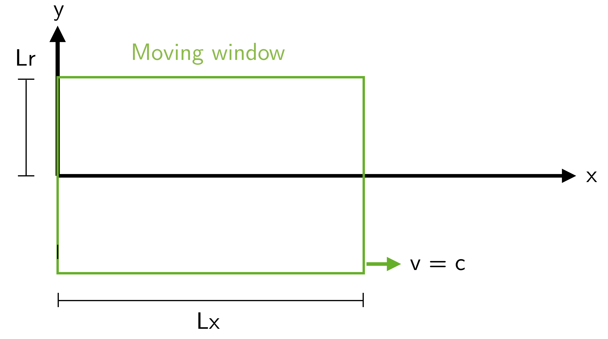
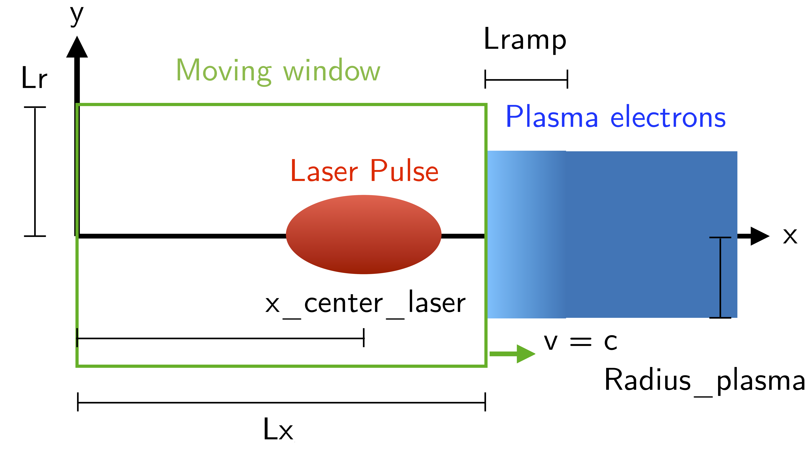

Handout
---------------------

Prelude
^^^^^^^^^^^^^^^^^^^^^^^^^^^^^^^^^^

0.1- Physical units normalization
^^^^^^^^^^^^^^^^^^^^^^^^^^^^^^^^^^
^^^^^^^^^^^^^^^^^^^^^^^^^^^^^^^^^^

The standard physical units used by the scientific community are given by the International System of Units (SI), 
however, simulation codes typically use normalized units. In this practical, all input and output quantities are in normalized units.

You do not need to concern yourself with conversions in the input namelist: 
using appropriate variable definitions, the values in SI of physical quantities will be clearly displayed 
when reading the namelist. However, some exercises may require you to perform conversions from normalized 
to SI units. It is possible to perform these conversions automatically using the postprocessing library ``happi``, 
but this is not covered in this practical work. Instead, `see tutorials, basic units <https://smileipic.github.io/tutorials/basics_units.html>`_ for more information.

.. _table1:
.. list-table:: Normalizations
   :widths: 25 25
   :header-rows: 1

   * - Physical quantity 
     - Reference for normalization
   * - Time
     - :math:`\omega_r^{-1}`   
   * - Velocity
     - :math:`c`
   * - Charge
     - :math:`e`
   * - Mass
     - :math:`m_e`
   * - Momentum
     - :math:`m_e c`
   * - Energy, Temperature
     - :math:`m_e c^2`
   * - Length
     - :math:`c/\omega_r`
   * - Number density
     - :math:`n_r=\varepsilon_0 m_e \omega_r^2/e^2`
   * - Electric field
     - :math:`m_e \omega_r c /e`
   * - Magnetic field
     - :math:`m_e \omega_r /e`

As shown in :ref:`Table. 1 <table1>`, charge and mass are normalized to the elementary 
charge :math:`e` and electron mass :math:`m_e`, respectively. Additionally, all velocities 
are normalized to the speed of light in vacuum :math:`c` which naturally arises
from Maxwell’s equations. In this set of units, the normalized
speed of light in vacuum is :math:`1`. 

Now, the unit of time - here defined as :math:`\omega_r^{-1}`, 
with :math:`\omega_r` being the reference angular frequency- it is not defined a priori and is instead
chosen by the user. Once the unit of time (or equivalently the unit of length) 
is chosen, all other units are uniquely defined as detailed in :ref:`Table. 1 <table1>`.

It is worth noting that the density associated with each plasma species is not 
in units of :math:`(c/\omega_r)^{-3}` but instead in units of :math:`n_r=\varepsilon_0 m_e \omega_r^2/e^2`. In the following 
exercises, where you will be required to make conversions from code units, 
assume that the laser wavelength is :math:`\lambda_0=0.8\mu m` (that of a Ti:Sa laser system). 
This choice implies that a unit of length is :math:`c/\omega_r=\lambda_0/2\pi` and a unit of time is
:math:`\omega_r^{-1}=\lambda_0/2\pi c`, what is in accordance with :ref:`Table. 1 <table1>`.

Although it is possible to define your simulation in SI units, it is simpler 
to perform the conversion in the InputNamelis file. 
In this way, the code will work with normalized units, like many other 
codes worldwide. Therefore, for future simulation activities, 
it is crucial to learn how to work with this kind of unit, also called code units.

**- Exercise 1:** 
Assuming :math:`\lambda_0=0.8\mu m` (a typical Ti:Sa laser system), 
*i)* what is the value of the critical density? *ii)* What is the value of the normalizing 
electric field :math:`E_0`? 
This choice of :math:`\lambda_0` shall be utilized throughout all subsequent exercises. 

*Hint:* Use :ref:`Table. 1 <table1>` for the calculations and the reference quantities in the
`InputNamelist.py <https://github.com/SmileiPIC/TP-M2-GI/blob/main/InputNamelist.py>`_ 

0.2- Prepare for the practical exercises
^^^^^^^^^^^^^^^^^^^^^^^^^^^^^^^^^^^^^^^^
^^^^^^^^^^^^^^^^^^^^^^^^^^^^^^^^^^^^^^^^

In any experiment, you need to prepare your set-up. 
For a numerical experiment, your need to prepare your interface and the computing environment. 
Follow the instructions in the section `Instructions for using the cluster` in :ref:`Useful Tools <UsefulTools>` to respectively: login to the machine for your 
simulations, compile the code, create your simulation folders, submit, 
and postprocess your simulations. To avoid losing data, it is recommended to 
creating a folder for each simulation you perform. 
In each folder, you have to copy the input namelist 
`InputNamelist.py <https://github.com/SmileiPIC/TP-M2-GI/blob/main/InputNamelist.py>`_ and the Smilei executable files 
(the ones called ``smilei`` and ``smilei_test``, the last is optional). 
To check if your input file does not contain errors (*e.g.,* when you change some parameter),
you can use the command ``./smilei_test InputNamelist.py``. 
If everything goes well in your test, the word END should appear in your screen and then you can launch your 
simulation with the `submission_script.sh <https://github.com/SmileiPIC/TP-M2-GI/blob/main/submission_script.sh>`_ . 
Normally, 10 MPI processes and 2 threads OpenMP should be sufficient to run 
the longest of your simulations in this practical within 3 minutes 
(these parameters are already set in the submission script). 
Remember that you can submit multiple simulation jobs in different 
folders to let them run in parallel.
Always copy the file `InputNamelist.py <https://github.com/SmileiPIC/TP-M2-GI/blob/main/InputNamelist.py>`_  to the folder where you want to run 
your simulation and then, uncomment the necessary lines and blocks as described you need (It will be further detailed in the next section). 
After these steps, everything you need for 
your simulations is ready. For the postprocessing, remember to compile the ``happi`` 
library as explained `here <https://smileipic.github.io/Smilei/Use/installation.html#install-the-happi-module>`_.

To summarize, in each simulation folder you must have the files ``smilei``, ``InputNamelist.py`` and the ``submission_script.sh``.

0.3- Exploring the input namelist
^^^^^^^^^^^^^^^^^^^^^^^^^^^^^^^
^^^^^^^^^^^^^^^^^^^^^^^^^^^^^^^

Take a look at the file, but for now, ignore the commented blocks and variables

The code requires an input namelist file that describes the simulation you want to run. 
As anticipated, for this practical work, this input file is the `InputNamelist.py <https://github.com/SmileiPIC/TP-M2-GI/blob/main/InputNamelist.py>`_. 
Open this file with a text editor, e.g., ``nano``, ``gedit`` or ``vim`` 
(if in ``vim`` the file syntax is not colored, use ``:syntax enable``) 
or with another editor of your choice (our recomendation is use ``nano``). Then,  
look at the contents of the file, but for now, ignore the commented blocks and variables.

The file starts with the definition of physical constants and units,
mesh points, integration timestep, etc. 
Some of these parameters are inserted in the first block of the simulation, called ``Main`` block. 
Others may be useful for conversions between units or to define other variables in the file.

In the ``Main`` block, you also find the geometry of the simulation, which is ``AMcylindrical``.
The grid is defined on a cylindrical space and with cylindrical coordinates `x`, `r`, but the particles move in the 3D space 
`x`, `y`, `z` (See :ref:`Fig. 1 <Mesh_and_Reference>`). 
In the simulations of this practical work, Maxwell’s equations are solved in 
cylindrical coordinates with cylindrical symmetry, which allows for quick 
simulations with 3D accuracy.

.. _Mesh_and_Reference:
.. figure:: _static/Mesh_and_Reference.png
  :width: 15cm

  Reference axes of the simulation. The simulation window corresponds to the cylinder with radius ``Lr`` and length ``Lx``.

.. _Schema_Simulation_0:

  Simulation Setup in this Section (not in scale)
    
.. _Exercise2:
**- Exercise 2:** *i)* What are the longitudinal size ``Lx`` and radial size ``Lr`` 
of the simulation window? *ii)* How many mesh points ``nx`` and ``nr`` are used? 
See Figures :ref:`1 <Mesh_and_Reference>` and, :ref:`2 <Schema_Simulation_0>` for reference, and find these lengths in the `InputNamelist.py <https://github.com/SmileiPIC/TP-M2-GI/blob/main/InputNamelist.py>`_.

0.4- The MovingWindow block
^^^^^^^^^^^^^^^^^^^^^^^^^^^

Note a block called ``MovingWindow`` in the `InputNamelist.py <https://github.com/SmileiPIC/TP-M2-GI/blob/main/InputNamelist.py>`_. 
In the physical case being considered, a laser pulse with duration of tens 
of femtoseconds propagating for :math:`\approx 400\mu m` along the positive `x` direction is simulated.  We are only interested in phenomena near the laser pulse 
(within tens of microns), like plasma wave excitation, so it would be very 
inefficient to simulate all the physical space (and plasma particles when present) 
in a box with a length of hundreds of microns. For this reason, the code has the 
option to use a Moving Window, which emulates a camera moving at the speed 
we want, along the positive `x` direction. In this physical case, it is convenient 
to have a window/camera moving with the laser, so we set the average speed 
of the moving window to `c` to follow the laser. As a result, 
the laser pulse is almost immobile in the simulation window

The size of the our moving simulation window is tens of microns, 
so if it moves with the laser, we will be sure to see all the relevant phenomena of 
plasma wave excitation near the pulse.

0.5- The Diag blocks
^^^^^^^^^^^^^^^^^^^

At the end of the `InputNamelist.py <https://github.com/SmileiPIC/TP-M2-GI/blob/main/InputNamelist.py>`_ file,
there are blocks starting with the word ``Diag``. As you can imagine, these blocks are for the diagnostic of the code. 
The first Diag is a ``DiagProbe`` defined on a line 
(so a 1D diagnostic), on the propagation axis of the laser (the `x` axis). 
This diagnostic returns the value of some physical fields 
along that axis. We call this probe ``Probe0`` (the ``0`` because 
it is the first ``Probe`` in the namelist). The second diagnostic block is 
a ``DiagProbe`` defined on the plane `xy` (so a 2D diagnostic). 
This is the second probe of the namelist, so it is called ``Probe1`` (Python starts counting from zero.)
 
Inside these ``DiagProbe`` blocks, the physical quantities 
we are interested in are specified. For this practical, you do not have 
to write new postprocessing scripts, since Smilei includes a postprocessing 
library, called ``happi``, to analyze the code results. For the purposes of 
the practical, the happi commands explained in Postprocessing section of the :ref:`Useful Tools <Postprocessing>` 
and in scripts are enough to start.

However, if you prefer to work with numpy arrays in ``Python``, at the end of the Postprocessing section of the :ref:`Useful Tools <Postprocessing>` , you can find how to export the output to that format. 
If you prefer to work with other languages for postprocessing, you can export 
the data to a ``numpy`` array and then write them to a file readable with your 
language of choice. 

The last exercises of this practical require you to write 
postprocessing scripts using the commands you can find in the already 
provided postprocessing scripts.

0.6- Steps to simulate plasma acceleration
^^^^^^^^^^^^^^^^^^^^^^^^^^^^^^^^^^^^^^^^^^^
^^^^^^^^^^^^^^^^^^^^^^^^^^^^^^^^^^^^^^^^^^^

Having completed the preliminary steps, including the first two exercises, 
you are now ready to proceed with the practical exercises. 

You will proceed with the full laser wakekfield simulations in three steps

    - :ref:`First part: simulation of the laser pulse propagating in vacuum;  <laserpulseinvacuum>`
    - :ref:`Second part: simulation of the plasma waves in the wake of the laser pulse; <plasmawave>`
    - :ref:`Third part: simulation of the acceleration of electrons in the laser wake wave. <laserplasmainhection>`

Initially, in the input namelist, only the essential blocks such as the "Main" block are uncommented. 
With this code, it is possible to perform the first part of this practical work. 
To perform the second part, you have to additionally uncomment the plasma block and finally, to perform the third part, 
you have to uncomment the blocks used for the electron bunch.

To complete the practical work, read the instructions in the following sections, 
complete the related simulation exercises and ask the instructor if you have any doubts. 
Without further ado, let us get started!

.. _laserpulseinvacuum:
First part: Laser pulse
^^^^^^^^^^^^^^^^^^^^^^

1.1- Laser pulse propagating in vacuum
^^^^^^^^^^^^^^^^^^^^^^
^^^^^^^^^^^^^^^^^^^^^^

Everything is ready to run your first simulation: just uncomment the lines 
with the laser pulse parameters and the ``LaserEnvelopeGaussian`` block. 
This block defines a Gaussian laser pulse in the simulation. 
The considered pulse will also have a Gaussian temporal envelope profile.

Normally you would simulate a laser pulse with all the high frequency oscillations 
at frequency :math:`\omega_0 = 2\pi c/\lambda_0`. This is surely the most accurate approach, but it would 
need a very fine resolution and integration timestep and consequently 
a very long simulation time (see :ref:`Fig. 3 <Envelope_Figure>`). 

.. _Envelope_Figure:

  Blue line: vector potential :math:`\hat{A}` of a laser pulse with Gaussian envelope. Red line: the laser envelope's absolute value :math:`|\tilde{A}|`. Both lines are sampled by a suitable number of points. Note that much less points are necessary to sample the envelope.

.. _Schema_Simulation_1:
.. figure:: _static/Schema_Simulation_1.png
  :width: 15cm

  Simulation Setup in this Section (not in scale). 

Note that in the most typical laser wakefield acceleration set-ups, the laser pulse temporal envelope 
(often modeled with a Gaussian profile) contains many optical oscillations. Thus, using a laser envelope 
model allows us to describe the laser-plasma interaction in terms of the envelope, 
resulting in quick simulations due to coarser sampling (see e.g., the derivations in [Cowan]_). 

In this kind of model, the laser evolution is described by an envelope equation, such as in a paraxial 
wave equation, for example. The laser radiation pressure on the plasma particles is described by 
the ponderomotive force, which depends only on the laser pulse envelope. 
With this approach, the accuracy of the results is sufficient to explore the basic physics of 
laser-plasma acceleration and, at the same time, allows for quicker simulations [Massimo]_.

**Note:**  since an envelope model is used to describe the laser pulse, 
the electromagnetic fields like ``Ex``, ``Ey`` (and the densities, as for example ``Rho``) they represent
the average of these quantities over the laser's optical oscillations. Thus, these quantities not show the 
oscillations at :math:`\omega_0` and :math:`2\omega_0` normally seen in a 
simulation of LWFA without an envelope model. The electromagnetic fields 
in output are those generated in the plasma, while the absolute value 
of the envelope of the transverse electric field of the laser is contained in 
the quantity ``Env_E_abs``.

The simulation now includes a moving window and a laser pulse, 
modeled with its envelope, as in :ref:`Fig. 4 <Schema_Simulation_1>`.

.. _Exercise3:
**- Exercise 3:** *i)* What are the waist size, FWHM duration in field, and intensity of the laser pulse as specified in the namelist file? 
*ii)* Where is the placed the laser pulse center in the simulation window at the start of the simulation? *iii)* Where is the focal plane of the laser pulse?

.. _Exercise4:
**- Exercise 4:** The normalized laser peak field is given by :math:`a_0 = eE/m_e\omega_0c`,
where :math:`E` is the peak laser electric field and :math:`\omega_0 = 2\pi c/\lambda_0`
is the laser central frequency (:math:`\lambda_0 = 0.8 \mu m`.) 
What is the peak intensity :math:`I = c\varepsilon_0 |E|^2` of the laser pulse? 
Suggestion: the input namelist contains the physical quantities that you may 
need for the conversions.

After you have uncommented the necessary lines (try again ``./smilei_test Inputnamelist.py``), 
launch the simulation. When the simulation is completed, open ``IPython`` with the command ``ipython``. 
Then, you can check the initial position of the laser through the commands::

   import happi; S = happi.Open("path/to/simulation")
   S.Probe.Probe0("Env_E_abs",timesteps=0).plot( figure=1 )
   S.Probe.Probe1("Env_E_abs",timesteps=0).plot( figure=2 )

``Probe0`` is a 1D diagnostic defined on the laser propagation axis, while ``Probe1`` is a 
2D diagnostic defined on the plane :math:`xy`. Note that in the commands we have specified 
``timesteps=0`` to see the laser pulse at the start of the simulation. 

Check that the initial laser position that you are seeing is the same specified 
in the input namelist. Remember that the laser pulse is modeled through its envelope, 
so you can not see its high frequency oscillations with wavelength :math:`\lambda_0`.

Let us study the laser diffraction in vacuum. To see the evolution of the laser, use::

   S.Probe.Probe1("Env_E_abs").slide( figure=3 )

You can move the horizontal time bar to see the snapshots at different iterations.
Note that the Moving Window makes the laser seem immobile in the simulation, 
but it is moving at speed `c`, and the Moving Window is following it with the same speed.

If you do not specify a `vmax`` value (the colorbar maximum) in the previous command, 
``happi`` will change it at each iteration. To better see the laser diffraction, 
try to specify `vmax=0.05`. For example::

   S.Probe.Probe1("Env_E_abs").slide( figure=3,vmax=0.05 )

.. _Exercise5:
**- Exercise 5:** Let us check that the Gaussian laser pulse diffracts following 
the theory for a Gaussian beam [Siegman]_: :math:`w(x) = w_0\sqrt{1 + x^2/x^2_R }`, 
where :math:`w_0` is the initial laser waist size, :math:`w(x)` the laser
waist size at propagation distance :math:`x`, :math:`x_R` is the Rayleigh length 
:math:`x_R = \pi w_0^2/\lambda_0`. What is the theoretical Rayleigh length :math:`x_R`?

.. _Exercise6:
**- Exercise 6:** Use the script 
`Laser_waist_theory_vs_Smilei.py <https://github.com/SmileiPIC/TP-M2-GI/blob/main/Postprocessing_Scripts/Laser_waist_theory_vs_Smilei.py>`_ 
to compare the analytical diffraction law of the previous exercise and the code results. 
Copy the script in the simulation folder or call the script from that folder. 
The script loads the results, then loops over the iterations available in output 
and computes the laser pulse waist :math:`w(x)` as

.. math::
  :label: AzimuthalDecomposition1

  w(x) = 2\frac{\int\int |\tilde{A}|^2(y-\bar{y})^2dxdy}{\int\int |\tilde{A}|^2dxdy}.

Since the laser field goes to zero at the borders of the simulation window, 
instead of integrating over the infinite extension of space, we can limit 
our integrals to the simulation window space. After this computation, 
the simulated waist is compared to the corresponding analytical value. 

Run the script (from ``IPython`` use ``%run Laser_waist_theory_vs_Smilei.py``) 
to plot the comparison and include the image in your answers.

.. _plasmawave:
Second part: Plasma waves
^^^^^^^^^^^^^^^
^^^^^^^^^^^^^^^

2.1- Linear plasma waves
^^^^^^^^^^^^^^^^^^^^^^

In the previous section, it was verified that the laser pulse behaves as expected 
in vacuum. Now, let us add a preionized hydrogen plasma to excite plasma waves. 
The laser pulse is considered intense enough to assume that the hydrogen gas was already ionized much 
before the arrival of the laser pulse peak (see the laser intensity computed 
in :ref:`Exercise 3 <Exercise3>`).

Uncomment the first ``Species`` block, the related variable definitions and 
take some time to read them carefully. This block defines a particle ``Species``
in the simulation, whose name is plasmaelectrons. Note the normalized mass 
and normalized charge of these particles defined in this block (``1.0`` and ``-1.0`` respectively). 
Since the normalizing mass and charge are the electron mass and the unit charge,
we know that these particles are electrons. 

Since the simulation is in cylindrical coordinates, the plasma electron density 
profile can be defined by the set of coordinates :math:`(x, r)`, where :math:`r`
is the distance from the laser propagation axis. As you can see, for each point 
in space :math:`(x,r)` the plasma density profile is defined by the function 
``plasma_density(x, r)``. 

After a short linear ramp, the plasma density profile
is uniform within a region confined in a distance ``Radius_plasma=22`` :math:`μm` 
from the laser's propagation axis. This is not a realistic size for a real-world 
plasma for plasma acceleration. However, we can simulate 
a small-scale plasma like this without significantly altering the results, 
since the phenomena of interest occur near the laser pulse. Indeed, including particles farther from the laser's propagation axis would increase the 
computation time without changing the results, as you can verify after this practical.

Therefore, now the simulation includes a moving window, a laser pulse (modeled with its envelope) 
and electron plasma, as represented in :ref:`Fig. 5 <Schema_Simulation_2>`.

.. _Schema_Simulation_2:

  Simulation Setup in this Section (not in scale).

As we did with the simulation of the laser pulse diffraction in vacuum, 
the first step is to verify that the plasma behaves as predicted by 
the analytical theory. If we reduce the laser pulse ``a_0`` to ``0.01``, 
the laser pulse satisfy the conditions for the applicability of the 
1D linear theory of plasma wave excitation. 

The analytical 1D linear theory predicts the formation of a sinusoidal wave 
at plasma frequency :math:`\omega_p^2 = e^2n_0/m_e\varepsilon_0` behind the laser, 
where :math:`n_0` is the plasma density.

.. _Exercise7:
**- Exercise 7:** As you can see, the plasma density has a value 
:math:`n_0 = 0.0008` (in normalized units, i.e., normalized by the critical density in this case) 
in the uniform region. *i)* What is the plasma density value in physical units (electrons/:math:`cm^{3}`)? 
*ii)*  If you wanted to convert a plasma density value from SI units to code units using the conversion 
with the variable ``ncrit`` in the namelist, what command should you use? 
Note, you do not have to change the namelist.

.. _Exercise8:
**- Exercise 8:** Launch the simulation with :math:`a_0 = 0.01`. 
Study the evolution of the electric field ``Ex`` with the diagnostics ``Probe0`` and ``Probe1``. 
You can use the same plot commands of the previous section, but applied to ``Ex`` instead of ``Env_E_abs``, 
for example::

  S.Probe.Probe0("Ex").slide( figure=3 )
  S.Probe.Probe1("Ex").slide( figure=3 )

*i)* What is the theoretical plasma wavelength :math:`\lambda_p = 2\pi c/\omega_p`? 
See the formula for :math:`\omega_p` reported just before :ref:`Exercise 7 <Exercise7>` for the calculation. 
*ii)* What is the plasma wavelength found from the simulation results?
Note, an estimate inferred from the plot is sufficient for the purposes of this practical.

.. _Exercise9:
**- Exercise 9:** The longitudinal electric field on the axis of this linear 
plasma wave, according to the 1D linear theory [Esarey2009]_ applied to the considered case, 
is given by (in physical units):

.. _LinearTheory:
.. math::
  :label: LinearTheory

  E_x(x) = \frac{m_ec^2}{e}\frac{k^2_p}{4}\int_x^{+infty}|A|^2 cos[\omega_p(x−x')]dx'.

Use the script `Ex_linear_theory_vs_Smilei.py <https://github.com/SmileiPIC/TP-M2-GI/blob/main/Postprocessing_Scripts/Ex_linear_theory_vs_Smilei.py>`_
to compare the analytical result given by :ref:`Eq. (2) <LinearTheory>` and 
the simulated results (``%run Ex_linear_theory_vs_Smilei.py`` on ``IPython``).
Again, you will need to copy the script in the simulation folder or to call it from there. 
The script reads the absolute value of the envelope of the laser :math:`|\tilde{A}|`
from the simulation at a given time and then implements :ref:`Eq. (2) <LinearTheory>` to compute the analytical 
result for ``Ex``. Then it reads the longitudinal electric field ``Ex`` of the simulation 
to compare the theory with the simulation results. 

Does the simulation agree with theory? Include the image in your answers.

2.2- Nonlinear plasma waves 
^^^^^^^^^^^^^^^^^^^^^^^^^^^

With the laser and plasma parameters in the namelist, for :math:`a_0 \ll 1` 
the excited plasma waves is in the linear regime. 
As we saw in the previous exercise, the plasma wave in the wake of the 
laser is sinusoidal in the linear regime. Increasing :math:`a_0`, the laser becomes more intense. When 
:math:`a_0 \gtrsim 1` the electron plasma begins to reach relativistic velocities. At this limit, the electron inertia increases, elongating the plasma period and wavelength, 
resulting in electron accumulation at the end of each wave period
Moreover, increasing :math:`a_0`, the longitudinal electric field waveform changes from 
a sinusoid to a sawtooth wave [Esarey2009]_. 
In this regime of interest for plasma acceleration, PIC simulations become necessary since there are no longer general 
analytical solutions to the coupled Vlasov-Maxwell system of equations, and fluid theory cannot be applied.

Create three folders, ``sim1``, ``sim2``, ``sim3``, where you will launch the simulation with 
:math:`a_0 = 0.5, 1.4, 2.0` respectively. Take a look to the longitudinal electric 
field on axis (``Probe0``) and to the 2D plasma density (``Probe1``)::

   S.Probe.Probe0("Ex").slide( figure=1 )
   S.Probe.Probe1("-Rho").slide( figure=2 )

In the linear regime of interaction, you will probably not be able to see the oscillations 
in the density, but they can be easily seen in the electric field ``Ex``. 

In the nonlinear regime of interaction (higher :math:`a_0`), you will need to reduce the ``vmax`` 
in the plot/animate command to see the formation of the wake. This happens because, at the end 
of the plasma wave period, there is an accumulation of electrons, 
which hides the other charge density values. As you can see, 
by increasing the :math:`a_0`, the nonlinearities of wake excitation are 
progressively more evident. For each simulation, take a look at the excitation of the wave 
with the command ``animate`` of ``happi``.

.. _Exercise10:
**- Exercise 10:** It is interesting to compare the longitudinal electric field ``Ex``
of these three simulations to see how the wave profile changes increasing :math:`a_0`. 
With ``happi`` you can easily do it. Here are the commands for ``happi``::

  import happi
  S1=happi.Open("path/to/sim1")
  Ex1=S1.Probe.Probe0("Ex",timesteps=1000,label="a0 = 0.5") 
  S2=happi.Open("path/to/sim2")
  Ex2=S2.Probe.Probe0("Ex",timesteps=1000,label="a0 = 1.4")
  S3=happi.Open("path/to/sim3")
  Ex3=S3.Probe.Probe0("Ex",timesteps=1000,label="a0 = 2.0")
  happi.multiPlot(Ex1,Ex2,Ex3,figure=3)

The last command, ``multiPlot``, is used to superpose multiple lines in the same plot window. 
This command is also used in some of the exercises of the following section. 

*i)* Include the resultin image of the command above in your answers. 
*ii)* In another plot window, adapting the commands above to plot the plasma density ``-Rho`` from the three simulations. 
Include also this image in your answers.

**Behind the curtain:** Why ions are not present?
A plasma for laser wakefield acceleration is normally made of ions 
and electrons at least, so why ions are not present in this namelist? 
The answer can be found in the properties of Maxwell’s Equations and implies 
some derivations. 

For the moment it is sufficient to say that, since we set to zero the plasma 
electromagnetic field at the beginning of these simulations, and that we solve 
carefully Maxwell’s Equations and the particles equations of motion, 
defining the plasma electrons will make the code behave as if there was also 
a neutralizing layer of immobile ions. Since ions do not move in the 
timescales of interest for the phenomena we are simulating 
(their mass is `~1840` times larger than the electron mass), 
this is a reasonable approximation that in addition removes the need to 
simulate also the ions, with a significant computational gain. 
The complete answer for the interested reader can be found in the dedicated section of 
`this tutorial <https://smileipic.github.io/tutorials/advanced_wakefield_electron_beam.html>`_.

.. _laserplasmainhection:
Third part: Laser-plasma acceleration
^^^^^^^^^^^^^^^
^^^^^^^^^^^^^^^

3.1- External injection
^^^^^^^^^^^^^^^^^^^^^^^^^^^^^^^^^^^^^^^^^^^^^^^^^^^
^^^^^^^^^^^^^^^^^^^^^^^^^^^^^^^^^^^^^^^^^^^^^^^^^^^
Finally, everything is ready to simulate a plasma accelerator. 
Just as a surfer rides the waves in the sea, under certain conditions, 
a group of electrons can be accelerated by plasma waves.
Remember, an immobile surfer will not be accelerated by a wave. 
To effectively interact with the wave, the surfer must first paddle to acquire some velocity. 
If the surfer moves near the speed of the wave, an accelerating phase of the wave will be experienced 
by the surfer for a significant portion of the surfer-wave interaction. 

Following the same analogy, to be accelerated, the electrons must be injected in the accelerated phase 
of the plasma wave with a speed near the wave's velocity (approximately the speed of light). 
Many clever injection schemes have been investigated since the 2000s, such as those described in 
[Esarey2009]_, [Malka2012]_, [FaureCAS]_ , where the electrons of the plasma itself are in some way 
injected into the laser-driven wave. 

As antecipated, in this practical work we will study an external injection scheme, 
in which a relativistic electron bunch is injected from outside the plasma. 
This will allow us to understand the basic concepts of electron injection in a plasma wave,
even though it is more challenging to achieve experimentally.

Set again the :math:`a_0` of the laser to the value :math:`1.8`. 
Uncomment the second ``Species`` block, the related variable definitions and 
take some time to read them carefully. As you can see, this block defines a ``Species`` 
called ``electronbunch``, which we will inject in the plasma wave for acceleration. 
As for the ``Species`` called ``plasmaelectrons`` of the previous Sections, 
these particles have normalized charge and mass equal to ``-1.0`` and ``1.0`` respectively, 
thus they are electrons. In the present case, the plasma density is not defined through a
density profile function, but the coordinates and momenta of each of the bunch’s macro-particles 
are given to the code through arrays.

The variable ``npart`` defines the number of macro-particles of the bunch (in this case ``50000``) , 
and it also definnes the length of the bunch arrays: to initialize ``npart`` macro-particles 
one by one, you need an array of length ``npart`` for their `x` coordinates, 
an array of length ``npart`` for their `y` coordinates and one for the `z` coordinates. 
These coordinates are stored in the variable called ``array_position``, 
which also keeps an array of length ``npart`` to store the charge of each macro-particle 
(you do not need to understand right now how it is defined). 
You also need to initialize the momenta of the particle, which are stored 
similarly in the variable ``array_momentum``. In this case, these coordinates 
and momenta are generated from a Gaussian pseudorandom distribution, then they are multiplied by 
the numbers by their standard deviations to have a bunch with a ``rms`` size, 
``rms`` momentum spread and ``rms`` energy spread. You can note 
that the initialized bunch is already relativistic and has a Gaussian distribution 
in all the coordinate-momenta subplanes in the phase space. 
The electron bunch is initialized at waist, i.e., instantaneously not focusing, nor diverging.

For your future simulation work, this initialization method can be used also 
to use a macro-particle distribution obtained from another code 
(a magnetic transport code for conventional accelerators for example). 
Instead of generating randomly the particles coordinates and momenta, 
you only need to read them with Python. The arrays you obtain can 
thus be directly used by Smilei. Note that you can do this also for a plasma 
density distribution or laser intensity profile that you measure in an experiment. 
Instead of defining them through a Python function, you can read the 
experimental data and feed them to Smilei to simulate your measured plasma 
and/or laser profile.

The simulation now includes a moving window, a laser pulse (modeled with its envelope),
plasma electrons and an electron bunch, as in :ref:`Fig. 6 <Schema_Simulation_3>`.

.. _Schema_Simulation_3:
.. figure:: _static/Schema_Simulation_3.png
  :width: 15cm

  Simulation Setup in this Section (not in scale).
.. _Exercise11:
**- Exercise 11:** Reading the namelist, provide a description of the electron bunch at ``t = 0``: 
*i)* what is the total charge, the maximum energy, the `rms` sizes along `x`, `y`, `z`, the `rms` energy spread, and the emittance 
along the transverse planes?
*ii)* Where is the electron bunch placed in the simulation window initially?

3.2- The ``DiagTrackParticles`` block
^^^^^^^^^^^^^^^^^^^^^^^^^^^^^^^^^
^^^^^^^^^^^^^^^^^^^^^^^^^^^^^^^^^

To have a close look at the electron bunch during its propagation, 
you have to uncomment also the ``DiagTrackParticles`` block. 
As the name suggests, this diagnostic block allows to track particles, 
specified by their species name and some filter. Using a filter 
(e.g., selecting only the particles with energy higher than `50` MeV) is 
particularly useful when you have many particles in a ``Species``, 
like in the plasma of the namelist. In that case, not using a filter 
would make this diagnostic computationally heavy and would store 
the coordinates of too many particles. In the case of the bunch, 
there is no need to specify a filter, since the number of macro-particles 
is sufficiently small to be manageable. As you can see from the namelist, 
in this diagnostic, we store the coordinates and momenta of the particles, 
as well as their weight (from which their charge can be computed).

.. _Exercise12:
**- Exercise 12:** Launch the simulation, remembering to uncomment 
also the ``DiagTrackParticles`` block. Remember that the :math:`a_0` of the 
laser must be set again at :math:`a_0 = 1.8`. Remember to keep the folder 
and the data of this simulation, because they will be used in future exercises 
of the practical. This time the simulation will run a little longer, 
because the self-consistent electromagnetic field of the relativistic 
electron bunch must be computed first as initial condition and it requires some time. 
Plot the 2D charge density (use ``Probe1``) at the end of the simulation 
and play with the parameter ``vmax`` to be able to see the electron bunch 
in the plasma wave. Include this image in your answers.

.. _Exercise13:
**- Exercise 13:** With the same simulation of :ref:`Exercise 12 <Exercise12>`, use the command 
``happi.multiPlot`` (see Postprocessing or :ref:`Exercise 10 <Exercise10>`) to plot in the same window 
the longitudinal electric field ``Ex`` and the charge density ``Rho`` 
from ``Probe0`` (1d diagnostic) at the end of the simulation ``timestep = 5000``. 
You may need to rescale the quantities (see Postprocessing). 
Playing with multiplying factors in the plot you should be able 
to clearly see where the electron bunch is placed in the plasma wave.
Include this image in your answers.

.. _Exercise14:
**- Exercise 14:** With the same simulation of :ref:`Exercise 12 <Exercise12>`, run the script 
`Compute_bunch_parameters.py <https://github.com/SmileiPIC/TP-M2-GI/blob/main/Postprocessing_Scripts/Compute_bunch_parameters.py>`_ 
in the simulation folder to read the electron bunch parameters. 
For this purpose, from ``IPython`` you can use the command ``%run Compute_bunch_parameters.py timestep``, 
where ``timestep`` is the timestep you are interested in.
For example, the command ``%run Compute_bunch_parameters.py 5000``  will return the electron bunch parameters the end of the simulation.
*i)* What is the energy gain :math:`\Delta E` you measure from the start (``timestep = 0``) 
to the end of the simulation (``timestep = 5000``)? 
*ii)* What is the simulated propagation distance :math:`L`? 
*iii)* From these data, compute the average accelerating gradient :math:`E_{acc}`. 
*iv)* What is the absolute and relative `rms` energy spread at the beginning and 
at the end of the simulation? 
*v)* Report all the electron bunch parameters at the start and at the end of the simulation.

.. _Exercise15:
**- Exercise 15:** With the same simulation of :ref:`Exercise 12 <Exercise12>`, use the script `Follow_electron_bunch_evolution.py <https://github.com/SmileiPIC/TP-M2-GI/blob/main/Postprocessing_Scripts/Follow_electron_bunch_evolution.py>`_ to see how the beam has evolved during 
the simulation (``%run Follow_electron_bunch_evolution.py``
in ``IPython``). The script reads the ``DiagTrackParticles`` output and 
then computes some bunch quantities (`rms` size, emittance, energy, energy spread) 
at each available output iteration. 
*i)* Include the resulting image in your answers.
*ii)* From the evolution of the bunch energy, can you estimate the average accelerating gradient? 
Compare this value to the one computed in `Exercise 14 <Exercise14>`.

.. _Exercise16:
**- Exercise 16:** Create four new folders, ``sim1``, ``sim2``, ``sim3``, ``sim4`` 
where you will run four new simulation. In each simulation, the charge of the electron bunch will be changed to :math:`40, 60, 80,100 pC`, respectively.
Adapt the commands you have used in :ref:`Exercise 10 <Exercise10>` (``happi.multiPlot`` commands) to plot the longitudinal electric 
field ``Ex`` for the four cases. *i)* What do you observe? Include this plot in the answers.
*ii)* Use the script 
`Compute_bunch_parameters.py <https://github.com/SmileiPIC/TP-M2-GI/blob/main/Postprocessing_Scripts/Compute_bunch_parameters.py>`_
used for :ref:`Exercise 14 <Exercise14>` to find the energy of the 
electron bunch at timestep ``5000`` for each one of the four cases.
*iii)* Can you explain how the deformation of the ``Ex`` waveform results in different final energies?
*iv)* Include a plot of the energy gain of the bunch obtained for charges :math:`40, 60, 80, 100 pC`. 
*v)* Include a plot with the electron bunch charge on the horizontal axis and 
the energy gain on the vertical axis. You can use Python or any other language 
for this simple plot, for example: ::

  import matplotlib.pyplot as plt
  bunch=[40,60,80,100]
  energy=[100,100,100,100]
  fig = plt.figure()
  plt.plot(bunch, energy, 'ro', markersize=10)
  plt.xlabel(' ')
  plt.ylabel(' ')
  plt.show()

.. _Exercise17:
**- Exercise 17:** Create other four folders, ``sim5``, ``sim6``, ``sim7``, ``sim8``, 
where you will launch the simulation varying the bunch distance from the laser changing the ``delay_behind_laser`` parameter (Set again the charge to :math:`20 pC`). 
Try the values :math:`17, 18, 19, 20 \mu m`.
*i)* What is the observed final energy assuming each of the four ``delay_behind_laser`` parameters? 
*ii)* Using ``happi.multiPlot`` (see :ref:`Exercise 10 <Exercise10>`), plot the longitudinal electric field ``Ex`` for the four simulations (show all curves in the same window and include the final image in your answers).
*iii)* Using ``happi.multiPlot`` (see :ref:`Exercise 10 <Exercise10>`), plot the plasma density `Rho` for the four simulations (show all curves in the same window and include the final image in your answers).
*iv)* Can you explain the results from item *ii)* and *iii)*?
*v)* Include a plot with the ``delay_behind_laser`` on the horizontal axis and the energy gain on the vertical axis. You can use Python or any other language 
for this simple plot (see :ref:`Exercise 16 <Exercise16>`)

.. _Exercise18:
**- Exercise 18:** The accelerated electron bunch do not have the same energies, so it is interesting to see the energy distribution 
or energy spectrum of the bunch particles before and after the acceleration. 
*i)* Using the same simulation from :ref:`Exercise 12 <Exercise12>`, and the same approach of the script `Compute_bunch_parameters.py <https://github.com/SmileiPIC/TP-M2-GI/blob/main/Postprocessing_Scripts/Compute_bunch_parameters.py>`_, write a ``Python`` script to read the output of the ``DiagTrackParticles``, and then use it to draw the energy spectrum 
of the electron bunch (using MeV for the energies on the horizontal axis).  Provide the script and figures of the energy spectrum at timesteps ``0`` and ``5000``. 
*ii)* Comment briefly on the differences in the energy spectrum before and after acceleration.

*Hint 1:* You can create a new script from scratch, using commands from `Compute_bunch_parameters.py <https://github.com/SmileiPIC/TP-M2-GI/blob/main/Postprocessing_Scripts/Compute_bunch_parameters.py>`_
to read the macro-particle energies and then add your commands to plot a histogram of the energies, that will be the bunch spectrum. 
Alternatively (easiest solution), you can append your histogram commands at 
the end of `Compute_bunch_parameters.py <https://github.com/SmileiPIC/TP-M2-GI/blob/main/Postprocessing_Scripts/Compute_bunch_parameters.py>`_ or to a copy of that script.

*Hint 2:* you can use the matplotlib function ``numpy.histogram`` to compute a 
histogram of the macro-particles energies and the bins/edges of the horizontal axis.

.. _Exercise19:
**- Exercise 19:** For the same simulation of :ref:`Exercise 12 <Exercise12>`, using the ``TrackParticles`` diagnostic 
and ``Probe`` diagnostic, write a script that takes as an input variable, the iteration number i.e., ``timestep``. 
The script should plot in the same panel, the longitudinal electric field ``Ex`` along the propagation axis `x` and a scatter plot of the bunch electrons’ `x` and `px` 
to show the particles’ positions in the accelerating phase of ``Ex`` in that iteration. For an example, with normalized units, see :ref:`Fig. 7 <ExScatterXPx>`. 
In your answers, include the script and the output image for the timestep ``3000`` and ``5000``. Differently from :ref:`Fig. 7 <ExScatterXPx>`, 
use SI units in the plots (except for ``px``). For this goal, use the appropriate conversions. 
For the plot of ``px``, you can either use a scatter plot function or a classic plot 
function using only dot markers.

*Hint 1:* As for :ref:`Exercise 18 <Exercise18>`, you can either create a new script or you can add 
your commands at the end of `Compute_bunch_parameters.py <https://github.com/SmileiPIC/TP-M2-GI/blob/main/Postprocessing_Scripts/Compute_bunch_parameters.py>`_
or a copy of that script. For the ``Ex`` field on the propagation axis, you will need data from ``Probe0``.

*Hint 2:* To export the ``Ex`` data from ``Probe0`` with happi, use the function ``getData()``, e.g.::

  import numpy as np
  Ex = np.asarray(S.Probe.Probe0("Ex",timesteps= timestep).getData())[0,:]

You will also need an array for the horizontal axis with a size equal to the number of mesh points on
the `x` axis::
  import numpy as np
  x_mesh=np.linspace(0,S.namelist.Lx,num=S.namelist.nx)

*Hint 3:* The ``Ex`` and ``px`` will have very different scales, so you will need 
to use two `y` axes with different scales to see something meaningful. 
With matplotlib you can do it through ``twinx``.

*Hint 4:* The electrons’ `x` coordinates are absolute, while the ``Probe`` 
coordinates along the axis are relative to the moving window. To shift them 
including the movement of the MovingWindow, you can define an auxiliary variable 
to add/subtract the moving window’s relative coordinates through the
``getXmoved()`` command, e.g.::

  moving_window_x_shift = S.Probe.Probe0("Ex").getXmoved(timestep)

.. _ExScatterXPx:

  Longitudinal electric field ``Ex`` on axis and scatter plot of the bunch electrons’ `x` and `px`, at iteration ``1000``. For the sake of clarity, only a subset of the bunch particles has been plotted.

.. _Exercise20:
**- Exercise 20:** For the same simulation of :ref:`Exercise 12 <Exercise12>`, write a script 
similar to the one you wrote for :ref:`Exercise 18 <Exercise18>`, and :ref:`19 <Exercise19>`. As before, this script  must recive as an input 
the iteration number, a variable called e.g. ``timestep``. 
The script should plot in the same panel the electric field ``Ey`` and a scatter plot of electron bunch on the 
plane `xy`, to show the electrons’ positions in the focusing phase of ``Ey`` in that iteration. 
For an example with normalized units, see :ref:`Fig. 8 <EyScatterXY>`. In your answers, include the script and a screenshot of the output image for the iterations ``1000`` and ``5000``. 
Differently from :ref:`Fig. 8 <EyScatterXY>`, use SI units in the plots. For this goal, use the appropriate conversions. 

*Hint 1* As for :ref:`Exercise 18 <Exercise18>`, :ref:`19 <Exercise19>`, you can either create a new script, or add your 
commands to `Compute_bunch_parameters.py <https://github.com/SmileiPIC/TP-M2-GI/blob/main/Postprocessing_Scripts/Compute_bunch_parameters.py>`_ or a copy of that script.

*Hint 2:* You can obtain the ``Ey`` on the plane `xy`` exporting ``Probe1`` to a ``numpy`` array, e.g::

  import numpy as np
  Ey = np.asarray(S.Probe.Probe1("Ey",timesteps = timestep).getData())[0,:,:]

*Hint 3:* for a 2D plot, the ``Python`` function ``imshow()`` of ``matplotlib.pyplot`` 
is recommended, which takes in input the field to plot, the extent of the window 
coordinates and in case the minimum and maximum field number, e.g.::
  import matplotlib.pyplot as plt
  plt.imshow(Ey.T,extent = [Xmin,Xmax,Ymin,Ymax], vmin=..., vmax=...) 

Remember that the transverse size of the window is ``2*Lr`` (see :ref:`Fig. 1 <Mesh_and_Reference>`). :ref:`code <target to code>`

.. _EyScatterXY:

  Electric field ``Ey`` on the plane `xy` and scatter plot of the bunch electrons’ `x` and `y` coordinates, at iteration ``3000``. 
  For the sake of clarity, only a subset of the bunch particles has been plotted.
----

References
^^^^^^^^^^

.. [Cowan] `Benjamin M. Cowan et al., Characteristics of an envelope model for laser–plasma accelerator simulation, Journal of Computational Physics, 230(1):61 – 86, 2011 <https://doi.org/10.1016/j.jcp.2010.09.009>`_
.. [Massimo] `F. Massimo et al., Numerical modeling of laser tunneling ionization in particle-in-cell codes with a laser envelope model, Phys. Rev. E 102, 033204 (2020) <https://link.aps.org/doi/10.1103/PhysRevE.102.033204>`_
.. [Siegman] `Anthony E. Siegman, Lasers, University Science Books, 1986.`
.. [FaureCAS] `J. Faure, Plasma injection schemes for laser–plasma accelerators, CERN Yellow Reports, 1(0):143, 2016. <https://cds.cern.ch/record/2203634/files/1418884_143-157.pdf>`_